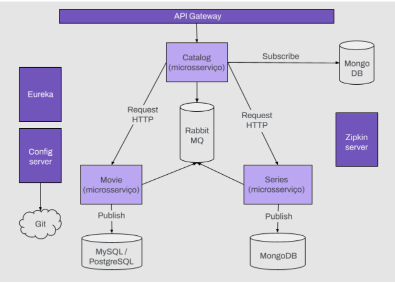

<h1 align="center"> DH - Checkpoint Final </h1>
<h1 align="center"> Backend II </h1>

<h4 align="center"> 
	🚀  SpringBoot Select  🚀  Spring Netflix Eureka  🚀
</h4>
 

  
  
    

   
   

 

:sunny::sunny::sunny::sunny::sunny::sunny::sunny::sunny::sunny::sunny::sunny::sunny::sunny::sunny::sunny::sunny::sunny::sunny::sunny::sunny::sunny::sunny::sunny::sunny::sunny::sunny:

 
 

# :beginner: Objetivo

  
 A partir da seguinte arquitetura de microsserviços, pedimos que você a implemente usando Spring Cloud. 

   

 

# :heavy_check_mark: Requisitos

### serie-service
- Configure Eureka para o novo serviço e use o nome: serie-service.
-  Configurar a configuração do servidor para obter a configuração de um repositório Git.
- Criar uma API que nos permita:
  - Obter uma lista de séries por gênero. Endpoint: /series/{genre} [GET].
  - Adicionar uma nova série. Endpoint: /series [POST].
- Adicionar RabbitMQ e enviar uma mensagem quando uma nova série for adicionada.

### movie-service
- Adicionar RabbitMQ e enviar uma mensagem quando um novo filme for adicionado.

### catalog-service
- Atualizar o catálogo usando Feign para adicionar a este serviço a busca de séries por gênero (serie-sevice) e adicioná-las à resposta do endpoint /catalog/{genre}
- Adicionar RabbitMQ e ouvir as mensagens enviadas por movie-service e serie-service. No caso de receber uma mensagem de qualquer serviço, atualize a lista correspondente, seja filmes ou séries.

### Zipkin
- Criar projeto e configurar o servidor Zipkin para receber mensagens de microsserviços.
- Adicionar Zipkin UI para visualizar os traços.
- Configure o Zipkin em cada microsserviço.
- Visualizar a comunicação entre microsserviços a partir da interface fornecida pela Zipkin UI.
- Implantação: todos os microsserviços devem ser implantados em dockers.
